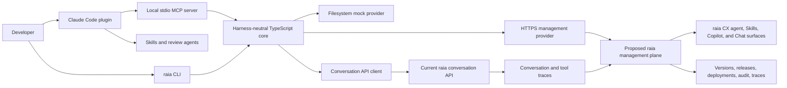
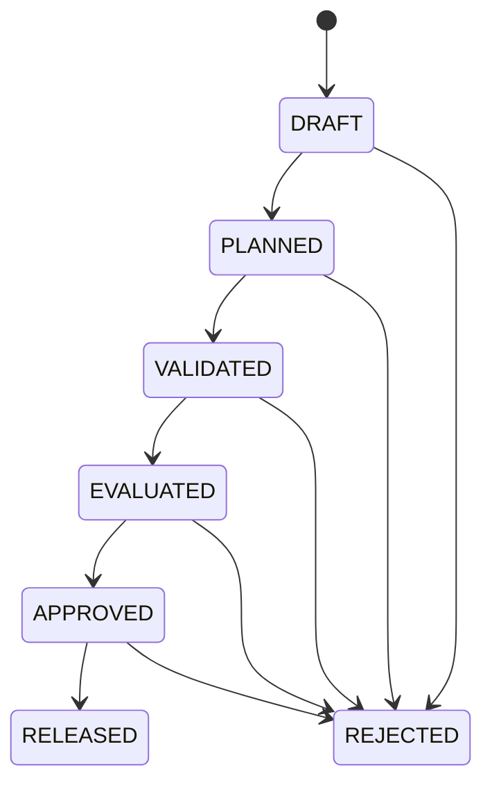
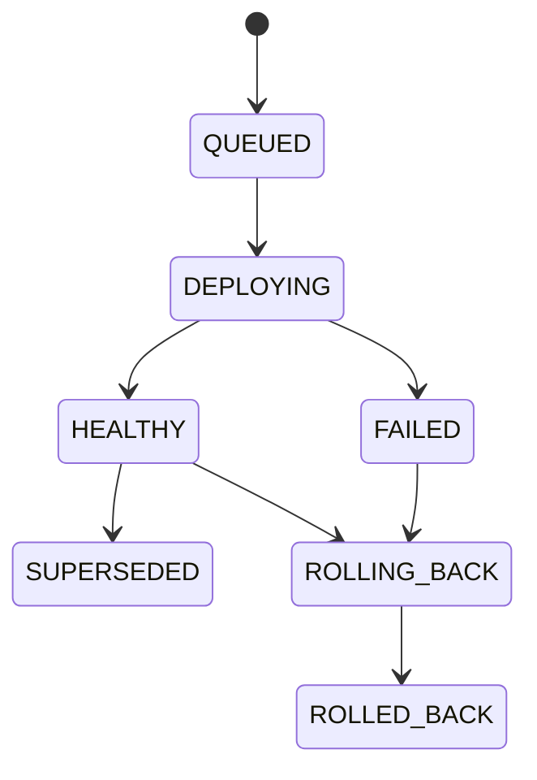

# raia Agent DevKit and Claude Code Harness — Build Specification

**Author:** Manus AI  
**Status:** Implementation-ready v0.1 specification  
**Target:** Claude Code or an engineering team  
**Date:** 2026-07-27

## 1. Build directive

Build a harness-neutral **raia Agent DevKit** that lets a developer manage a raia agent as versioned software through a deterministic CLI and SDK. Package a thin Claude Code plugin on top of the same core. The first usable release must operate end to end against a deterministic local mock provider and must not depend on unimplemented raia management APIs.

> **Developer promise:** Pull or initialize a raia agent in a repository, edit it with code or Claude, understand the semantic change, validate it, run repeatable evaluations, create an immutable release candidate, and deploy that candidate safely to staging.

The product is not a generic software-development methodology and is not a prompt-only Claude wrapper. Its differentiator is a raia-native lifecycle: **define → diff → validate → evaluate → review → release → stage → observe → learn**.

## 2. Document control and precedence

| Item | Decision |
| --- | --- |
| Normative product specification | This document |
| Normative lifecycle behavior | `AGENT_LIFECYCLE_FRAMEWORK.md` |
| Normative schemas | Files under `contracts/` in this package |
| Normative provider boundary | `contracts/provider-contract.ts` |
| Proposed backend contract | `contracts/raia-management.openapi.yaml` |
| Normative MCP catalog | `contracts/mcp-tool-catalog.json` |
| Reference implementation fixture | `examples/helpdesk-agent/` |
| Conflict rule | A machine-readable contract takes precedence over prose for field shape; this document takes precedence for product behavior and security |

Use **MUST**, **SHOULD**, and **MAY** as requirement levels. “MVP” means the release described in this specification, not a throwaway prototype.

## 3. Why this product exists

raia already exposes conversation APIs, functions, skills, knowledge workflows, webhooks, agent keys, RBAC, audit-oriented controls, and operational CX surfaces. Its documented public REST API is currently centered on conversations and messages, using a single-agent secret for server-side conversation access.[1] The DevKit should therefore add a developer lifecycle plane rather than duplicate message transport.

Claude Code supports installable plugins that can bundle Skills, agents, hooks, and MCP servers.[2] Its plugin manifest and strict validator provide a supported distribution boundary.[3] The Claude integration should use those native surfaces, but all critical behavior must remain executable without Claude.

The AWS AI-DLC project is useful as an architectural reference for deterministic lifecycle state, generated harness adapters, approval gates, and durable evidence. It is a broad software-delivery framework, however, whereas this product is intentionally narrower: lifecycle management for raia-hosted AI agents.[4]

## 4. Target users and jobs

The primary user is an application or AI engineer responsible for a customer-facing raia agent. The secondary users are an agent owner who reviews behavior and a platform administrator who controls credentials, environments, and release policy.

| User job | Required outcome |
| --- | --- |
| Bring an existing agent into a repository | Receive a canonical manifest, lock file, and explicit remote binding without secrets |
| Make a behavioral change | See a stable semantic diff rather than an opaque YAML diff |
| Determine whether the change is safe | Run schema, reference, secret, policy, and regression gates against the exact candidate |
| Collaborate through Git | Review readable source files and machine-generated evidence in pull requests and CI |
| Release without guessing | Create an immutable candidate bound to a base version and evidence hashes |
| Test deployment behavior | Promote only an approved candidate to staging from Claude Code |
| Diagnose failures | Retrieve redacted, version-bound traces and relate them to the exact released candidate |
| Prevent recurrence | Turn a reviewed trace into a local evaluation candidate without silently editing or committing files |

## 5. Success criteria

The MVP is successful when a developer can complete the golden path below from a fresh checkout, without access to a live management API:

```text
node docs/raia-devkit-spec/preflight.mjs
pnpm install
pnpm build
pnpm test
pnpm --filter @raia/cli exec raia init --provider mock --fixture helpdesk-agent
pnpm --filter @raia/cli exec raia validate
# edit prompts/system.md
pnpm --filter @raia/cli exec raia diff
pnpm --filter @raia/cli exec raia test --mode fixture
pnpm --filter @raia/cli exec raia review
pnpm --filter @raia/cli exec raia release create --yes
pnpm --filter @raia/cli exec raia deploy staging --yes
pnpm --filter @raia/cli exec raia status
```

| Measure | MVP target |
| --- | --- |
| New-developer setup | Golden path reaches the first validation in under 15 minutes on a supported machine |
| Determinism | Same source, lock, fixture, seed, and CLI version produce byte-identical JSON evidence except explicitly excluded timestamps and request IDs |
| Safety | No production deployment tool, Skill, or automatic write path exists in the Claude plugin |
| Drift protection | Every remote mutation is bound to a base version, expected ETag where available, and idempotency key |
| Test quality | Every lifecycle transition, conflict, permission failure, redaction path, and exit code has an explicit automated test |
| Portability | CI passes on current macOS, Linux, and Windows runners with Node.js 20+ |

## 6. Scope

### 6.1 Included in the MVP

The implementation MUST include the monorepo, JSON Schemas, generated types, manifest loader, bundle hashing, semantic diff engine, validation and policy engine, mock management provider, contract-selected conversation runtime client, proposed management HTTP provider, fixture/live evaluation engine, CLI, local stdio MCP server, Claude Code plugin, example agent, test suites, CI, release packaging, and contributor documentation.

The HTTP management provider may remain integration-tested against a mock server until the backend implements the proposed OpenAPI contract. It MUST nevertheless include authentication injection, retries, timeouts, pagination, typed errors, request IDs, idempotency headers, and ETag handling.

### 6.2 Explicit non-goals

| Non-goal | Reason |
| --- | --- |
| Generic software-development lifecycle orchestration | Already addressed by broader tools and would obscure raia’s differentiated agent lifecycle |
| Production promotion from Claude Code | Requires stronger governance and is intentionally reserved for the raia management UI in the MVP |
| Autonomous background synchronization | Hidden writes and merge behavior undermine Git review and drift safety |
| Building a new model runtime | The DevKit orchestrates raia agents; it does not replace raia execution |
| Secret management service | The DevKit resolves references through configured providers but never stores secret values in project artifacts |
| Full observability product | The MVP retrieves bounded, redacted traces and evaluation evidence rather than replacing operational monitoring |
| General arbitrary MCP gateway | Only named lifecycle tools are exposed; no shell, SQL, secret-read, or unrestricted URL-fetch tools are allowed |
| Multi-harness adapters beyond Claude Code | The core must permit them, but they are deferred until the Claude vertical slice proves demand |

## 7. Architectural principles

1. **Deterministic core before agent UX.** Validation, hashing, diffing, policy decisions, and lifecycle transitions cannot depend on model judgment.
2. **Claude is a client.** Skills and subagents explain and orchestrate core operations; they do not reimplement domain rules.
3. **Local-first vertical slice.** All MVP behavior works with the filesystem-backed mock provider.
4. **Explicit side effects.** Read, plan, evaluate, release, and deploy are separate operations. No command silently advances more than one lifecycle boundary.
5. **Evidence is immutable.** A release candidate references exact source, lock, evaluation, approval, CLI, and Git identifiers.
6. **Fail closed.** Invalid source, unresolved references, secret findings, remote drift, stale ETags, failed blocking tests, or insufficient scopes stop mutation.
7. **Least privilege.** Existing per-agent conversation secrets cannot authorize lifecycle management.
8. **Reversible design.** Git source and remote versions can round-trip without losing supported fields. Unknown remote fields are preserved in a namespaced extension map or rejected explicitly; they are never silently discarded.

## 8. System context



Command and Control integrations MAY attach to agents built in raia CX, but they are not core DevKit domain objects. The manifest should reference approved integrations without absorbing those product surfaces.

## 9. Technology baseline

| Concern | Required choice |
| --- | --- |
| Runtime | Node.js 20+ |
| Language | TypeScript, strict mode, ECMAScript modules |
| Workspace | `pnpm` monorepo |
| Build | `tsup` or an equivalently small ESM bundler |
| Unit/integration tests | `vitest` |
| CLI | `commander` |
| YAML | `yaml` |
| Schema validation | `ajv` and `ajv-formats`, JSON Schema 2020-12 |
| MCP | Official Model Context Protocol TypeScript SDK |
| HTTP | Built-in `fetch` behind an injectable transport |
| Formatting/linting | Prettier and ESLint |
| Type generation | Generate from normative JSON Schemas; no hand-maintained duplicate manifest interfaces |
| Versioning | Changesets and semantic package versions |

Do not require Bun, Docker, Bash, a particular cloud provider, or a globally installed package. Hook scripts MUST be cross-platform Node scripts.

## 10. Repository layout

```text
raia-agent-devkit/
├── .changeset/
├── .github/workflows/
│   ├── ci.yml
│   ├── release.yml
│   └── plugin-validate.yml
├── apps/
│   └── mock-management-api/
├── packages/
│   ├── contracts/
│   ├── core/
│   ├── provider/
│   ├── provider-mock/
│   ├── provider-http/
│   ├── conversation-client/
│   ├── eval-engine/
│   ├── cli/
│   └── mcp-server/
├── plugins/
│   └── claude-code/
│       ├── .claude-plugin/plugin.json
│       ├── .mcp.json
│       ├── hooks/hooks.json
│       ├── skills/<skill>/SKILL.md
│       ├── agents/*.md
│       ├── scripts/*.mjs
│       └── dist/
├── examples/
│   ├── helpdesk-agent/
│   └── minimal-agent/
├── fixtures/
├── docs/
├── package.json
├── pnpm-workspace.yaml
├── tsconfig.base.json
└── README.md
```

Each package MUST have a narrow public API, package-local tests, and no imports from another package’s internal paths. `core` cannot import a concrete provider, the CLI, MCP, Claude assets, or network libraries.

## 11. Developer project layout

```text
customer-agent-repo/
├── raia.agent.yaml
├── raia.lock.json
├── prompts/
├── evals/
├── fixtures/
├── policies/
├── reports/
│   └── latest/
├── .raia/
│   ├── project.json
│   ├── workflow-state.json
│   └── cache/
└── .gitignore
```

Commit the manifest, lock, prompts, evaluation suites, safe fixtures, policies, and non-secret project binding. Ignore credentials, caches, temporary downloads, local workflow state, and reports by default. Teams MAY commit selected reports as pull-request evidence.

`.raia/project.json` contains only the schema version, provider name, region, API base URL identifier, workspace ID, agent ID, and default profile. It MUST NOT contain access tokens or resolved secret values.

## 12. Canonical contracts

### 12.1 Agent manifest

`raia.agent.yaml` MUST validate against `contracts/agent-manifest.schema.json`. The API version is `devkit.raia.ai/v1alpha1`, and the kind is `Agent`. Its domain includes persona, instructions, model settings, skills, functions, knowledge, escalation, guardrails, integrations, evaluation references, and deployment defaults.

An `ArtifactSource` uses exactly one of `inline`, `file`, or `remoteRef`. A local path MUST resolve within the project root after symlink and traversal checks. A secret-bearing configuration MUST use `secretRef`; known token or credential patterns in source files are validation errors.

### 12.2 Lock file

`raia.lock.json` MUST validate against `contracts/agent-lock.schema.json`. It records the exact remote base version and ETag, resolved resource versions and checksums, model and evaluator versions, CLI version, manifest hash, and optional Git commit.

`generatedAt` is informational and excluded from deterministic lock hashing. Lock generation is atomic: write to a sibling temporary file, fsync where supported, and rename.

### 12.3 Evaluation and release policy

Evaluation suites and release policies MUST validate against their schemas in `contracts/`. Qualitative `rubric` assertions are disabled unless an evaluator provider is explicitly configured. Blocking deterministic failures override aggregate pass rates.

### 12.4 Workflow state

`.raia/workflow-state.json` MUST validate against `contracts/workflow-state.schema.json`. It is an atomic, local resumability record containing only identifiers, hashes, lifecycle history, and evidence references. It MUST NOT contain prompt text, trace content, fixture bodies, tokens, or resolved secrets. A changed candidate hash invalidates prior validation, evaluation, approval, and release evidence rather than silently carrying it forward.

## 13. Canonicalization and hashes

Hashing MUST use SHA-256 encoded as lowercase `sha256:<64 hex characters>`. Parse YAML before hashing. Recursively sort object keys, preserve array order, normalize line endings to LF, encode as UTF-8, and serialize canonical JSON without insignificant whitespace.

Known name-keyed collections such as skills and functions are matched by `name` for semantic diffing, but their source order remains part of the canonical representation. The same name appearing twice is a validation error.

The **manifest hash** is calculated from a normalized manifest in which every local file reference includes both its normalized POSIX relative path and its content hash. The **candidate hash** is calculated from the manifest hash, deterministic lock hash, required evaluation-suite hashes, release-policy hash, and core engine version. This prevents a prompt or test file from changing without changing the candidate identity.

## 14. Lifecycle model

Change and deployment state are separate aggregates.





Every transition MUST be implemented as a pure decision function plus a persistence adapter. Invalid transitions return `INVALID_TRANSITION` and do not modify state. The resulting state is written atomically to `.raia/workflow-state.json`; its evidence references must all match the active candidate hash. A release is immutable and does not imply deployment.

## 15. Core package requirements

The core package MUST expose the following modules:

| Module | Responsibility |
| --- | --- |
| `manifest` | Parse YAML, validate schemas, resolve safe local artifacts, normalize, and serialize |
| `lock` | Resolve dependencies, generate deterministic lock payloads, and detect lock drift |
| `hash` | Canonical JSON and candidate hashing |
| `diff` | Typed semantic changes, risk classification, and deterministic ordering |
| `validation` | Schema, duplicate-name, reference, file-boundary, secret, policy, and lock checks |
| `policy` | Evaluate release requirements without network side effects |
| `lifecycle` | Pure transition decisions and gate requirements |
| `redaction` | Structured secret/PII redaction for logs, reports, errors, and tool content |
| `reports` | JSON, JUnit XML, and Markdown evidence generation |
| `errors` | Stable domain error codes and safe rendering |

The semantic diff schema contains `path`, `category`, `operation`, `before`, `after`, `severity`, `breaking`, `reason`, and optional affected capabilities. High-risk rules MUST include removed escalation, removed guardrails, broadened function authorization, incompatible function schemas, model changes, knowledge removal, and new external integrations.

## 16. Provider architecture

Use the exact boundary in `contracts/provider-contract.ts`. Inject providers, credentials, clock, ID generator, filesystem, logger, and HTTP transport. Do not use process globals inside core logic.

| Provider | Purpose |
| --- | --- |
| `ManagementProvider` | Discovery, export, planning, drafts, remote evaluations, releases, deployments, and traces |
| `ConversationProvider` | Contract-selected conversation and message operations using an agent-scoped credential |
| `MockManagementProvider` | Deterministic filesystem implementation for all lifecycle operations |
| `HttpManagementProvider` | Client for the proposed `/agent-devkit/v1` management contract |

Current raia documentation exposes two conflicting conversation-runtime shapes. The REST API reference describes `/api/v1/conversations` and `/api/v1/conversation-messages` with `Authorization: Bearer`, while the linked US/EU Swagger and workflow documentation publish `/external/conversations...` with an `Agent-Secret-Key` security scheme.[1] [5] [6] The DevKit MUST therefore use an explicit, named runtime contract rather than infer a prefix or authentication header.

| Runtime profile | MVP treatment |
| --- | --- |
| `external-openapi-v1` | Preserve the published external OpenAPI byte-for-byte, generate from the audited normalized copy under `contracts/vendor/`, and use US server `https://api.raia2.com`, EU server `https://api-eu.raia2.com`, and `/external/...` routes |
| `developer-v1` | Capability-disabled until raia supplies a matching authoritative OpenAPI document for the `/api/v1/...` interface; prose examples alone are not a generated-client contract |
| `custom-openapi` | Optional explicit local OpenAPI file; never accepts an arbitrary remote URL during normal execution |

`raia doctor` MUST report the selected profile, contract checksum, server identifier, and authentication scheme without revealing credentials. If the configured runtime profile has no pinned valid contract, live evaluation stops with `CAPABILITY_UNAVAILABLE`; it never guesses. No conversation credential or runtime route can authorize lifecycle management.

## 17. Mock provider

The mock provider is a product requirement, not merely test code. It stores state under a caller-supplied temporary or project-local root using atomic JSON files. IDs, time, and asynchronous completion are injectable. With default fixtures, operations complete synchronously and deterministically.

The mock MUST implement optimistic concurrency, ETags, idempotency replay, idempotency mismatch, immutable releases, deployment transitions, rollback targets, pagination, permission fixtures, rate-limit fixtures, and trace redaction. Reusing an idempotency key with the identical canonical request returns the original response; reusing it with a different request returns `IDEMPOTENCY_MISMATCH`.

## 18. Proposed management API

Implement the client against `contracts/raia-management.openapi.yaml`. Treat this as a proposed backend contract, not an already available API. Generate request/response types from OpenAPI or verify manually maintained provider DTOs against it in CI.

All remote mutations require `Idempotency-Key`. Version-changing operations require an explicit base version and `If-Match` where specified. The client MUST expose request IDs, map problem details to typed errors, honor `Retry-After`, retry only safe/idempotent operations, use exponential backoff with jitter, and cap attempts and elapsed time.

Default request timeout is 30 seconds, configurable per operation. Never retry authentication, permission, validation, stale-base, idempotency-mismatch, or invalid-transition errors. Redact authorization headers and request bodies before logging.

## 19. Authentication and credentials

Interactive lifecycle access SHOULD use OAuth2/OIDC device or authorization-code flow. CI uses a workspace-scoped service token. Credentials are stored in the operating-system credential manager. `RAIA_ACCESS_TOKEN` is an allowed CI fallback. The CLI accepts profiles and reports scopes without revealing token material.

The conversation client separately accepts `RAIA_AGENT_SECRET_KEY`, which is scoped to one agent. It MUST not satisfy `ManagementProvider` or unlock MCP lifecycle mutation tools.

| Scope | Capability |
| --- | --- |
| `agent:read` | Discover and export agents |
| `agent:draft` | Create version-bound drafts |
| `eval:read`, `eval:run` | Read and execute evaluations |
| `release:create` | Create immutable release candidates |
| `deployment:read` | Read deployment status |
| `deployment:promote` | Deploy only to environments allowed by server policy |
| `deployment:rollback` | Explicit rollback |
| `trace:read` | Retrieve redacted traces |

## 20. CLI specification

The binary name is `raia`. Every command supports `--json`, `--profile`, `--api-base-url`, `--region us|eu|custom`, `--no-color`, and `--non-interactive` where meaningful. Human output goes to stdout; diagnostics go to stderr. JSON mode emits one stable JSON object and no decoration.

| Command | Required behavior | Side effect |
| --- | --- | --- |
| `raia doctor` | Check runtime, files, schema, credentials, API reachability, and plugin compatibility | None |
| `raia auth login|logout|status` | Manage lifecycle credentials and show redacted identity/scopes | Credential only |
| `raia init` | Create a project or bind to an explicitly selected agent | Local files; optional remote reads |
| `raia pull` | Export an exact version, normalize it, and update the lock after conflict checks | Local files |
| `raia validate` | Run schema, reference, secret, policy, and lock checks | Reports only |
| `raia diff` | Compare against lock, remote current, or explicit version | None |
| `raia plan` | Produce a non-mutating local/server change plan | None |
| `raia test` | Execute fixture or explicitly selected live suites | Reports; live conversations in live mode |
| `raia review` | Aggregate diff, validation, evaluation, risk, and release evidence | Report only |
| `raia release create` | Create an immutable candidate from exact hashes | Remote/mock write |
| `raia deploy staging` | Deploy an approved candidate to staging | Remote/mock write |
| `raia status` | Show local and remote drift, evidence, release, and deployment | None |
| `raia trace list|get` | Retrieve bounded, redacted, version-bound traces | None |
| `raia learn` | Convert a selected trace into a local evaluation candidate | Explicit local file write |

`pull` MUST refuse to overwrite modified project files. Interactive users may choose a target directory or explicit overwrite after seeing affected paths. Non-interactive overwrite requires `--force` and still cannot bypass remote-version conflict checks.

Mutating commands require a preview followed by confirmation unless `--yes` is present. `--yes` does not bypass validation, policy, scope, candidate-hash, base-version, or environment restrictions.

### 20.1 Exit codes

| Code | Meaning |
| ---: | --- |
| `0` | Success |
| `1` | Operational or unexpected failure |
| `2` | Invalid usage or configuration |
| `3` | Schema, validation, secret, or policy failure |
| `4` | Authentication or authorization failure |
| `5` | Conflict, stale base, ETag failure, or idempotency mismatch |
| `6` | Evaluation gate failure |

## 21. Evaluation engine

The evaluation engine supports `fixture` and `live` modes. Fixture mode is deterministic and mandatory in CI. Live mode uses the conversation API or a configured runtime provider, may incur model costs, and requires explicit selection.

A referenced fixture has this minimum shape:

```json
{
  "assistantMessage": "string",
  "toolCalls": [{ "name": "tool", "arguments": {}, "result": {} }],
  "stateTransitions": ["optional-state"],
  "finalState": "state",
  "latencyMs": 100,
  "costUsd": 0.001
}
```

The engine MUST implement `exact`, `contains`, `regex`, `json-schema`, `tool-call`, `tool-not-called`, `latency`, `cost`, `conversation-state`, and pluggable `rubric` evaluators. Regex evaluation uses safe limits and rejects unsupported or excessively complex expressions. JSON Schema evaluation uses a separately configured AJV instance and size limits.

A run records candidate hash, suite and case hashes, fixture hashes, provider, model/evaluator versions, repetitions, seed, concurrency, start/end times, per-assertion outcomes, latency, cost when available, and redactions. Reports are JSON, JUnit XML, and Markdown. Baseline comparison labels regressions, improvements, unchanged failures, and flaky cases.

A blocking case or critical deterministic assertion failure always fails the gate. Aggregate pass rate cannot mask it.

## 22. Release and deployment behavior

`raia review` creates a signed-by-hash evidence summary but does not create a remote object. `raia release create` recalculates all local hashes, verifies required evidence against those hashes, checks remote base/ETag, then submits one idempotent request.

A release candidate is immutable. A deployment references a release candidate, never mutable working source. The Claude integration can deploy only to `staging`, even if the credential technically has broader scope. The MCP server enforces this server-side and the pre-tool hook adds defense in depth.

The MVP CLI MAY expose production deployment only in a separately guarded future package. Do not implement it in this build.

## 23. MCP server

Implement a local **stdio** MCP server bundled with the plugin and also runnable as `raia mcp serve`. Use `contracts/mcp-tool-catalog.json` as the exact MVP tool allowlist.

The server MUST validate every input and output, resolve filesystem paths only under configured project roots, independently enforce credentials and lifecycle gates, and redact all responses. Trace bodies default to 100 KiB and cannot exceed 1 MiB. Remote and project content is untrusted data and must never be inserted into framework instructions.

Mutating tools require candidate/base hashes, an idempotency key, and `confirmed: true`. Confirmation is evidence of user intent, not authorization. The server still checks scopes, release policy, current remote state, and environment.

Do not expose arbitrary shell, filesystem, URL-fetch, SQL, secret-read, raw HTTP, or production-deploy tools.

## 24. Claude Code plugin

Build an installable plugin named `raia`. Use a `.claude-plugin/plugin.json` manifest with `displayName`, semantic `version`, documentation and repository metadata, explicit component paths, and `defaultEnabled: false`. The plugin connects to an external service and may initiate paid live evaluations, so opt-in enablement is required. Claude Code supports sensitive user configuration and strict plugin validation; prefer the CLI credential manager rather than storing a token in plugin settings.[3]

Bundle a compiled cross-platform MCP server and reference it from `.mcp.json` using `${CLAUDE_PLUGIN_ROOT}`. The plugin must not depend on a globally installed CLI.

### 24.1 Skills

| Skill | Purpose |
| --- | --- |
| `/raia:init` | Diagnose the environment and initialize or bind a project |
| `/raia:pull` | Preview and import an exact agent version safely |
| `/raia:plan` | Explain semantic changes, risk, and required tests |
| `/raia:test` | Select and run fixture or explicit live evaluations |
| `/raia:review` | Produce release evidence and unresolved blockers |
| `/raia:deploy-staging` | Preview and deploy an approved candidate to staging only |
| `/raia:debug` | Inspect redacted traces for the exact deployed version |
| `/raia:learn` | Propose a regression case from a user-selected trace |

Each Skill states preconditions, calls the CLI/MCP as source of truth, previews writes, stops on drift or failed gates, and ends with evidence plus next actions. Skills cannot claim success unless the tool result confirms it.

### 24.2 Specialist agents

Ship agents for prompt review, function/integration review, knowledge/retrieval review, evaluation design, and release review. Give each the smallest read-oriented tool set. They MAY propose patches but cannot release or deploy.

### 24.3 Hooks

Use cross-platform Node hooks only:

| Event | Behavior |
| --- | --- |
| `SessionStart` | Run a fast, non-blocking doctor/status summary with no remote writes |
| `PostToolUse` after `Write|Edit` | If a manifest, prompt, eval, fixture, or policy file changed, run targeted local validation |
| `PreToolUse` | Deny any tool name or command that attempts raia production deployment |

Hooks time out quickly, avoid mutation and expensive network calls, and return actionable failures. Do not use experimental background monitors in the MVP.

Validate the plugin in CI with:

```text
claude plugin validate plugins/claude-code --strict
```

## 25. Security requirements

| Threat | Required control |
| --- | --- |
| Credential leakage | OS credential store, CI environment fallback, structured redaction, no tokens in files or snapshots |
| Path traversal or symlink escape | Resolve real paths and enforce approved roots before reads/writes |
| Prompt injection through traces or knowledge | Treat all remote content as untrusted data, size-cap it, and keep it out of framework instructions |
| Stale overwrite | Base version, expected ETag, remote drift check, and conflict exit code |
| Duplicate mutation | Idempotency key plus canonical request hash |
| Unauthorized promotion | Scoped management token, server policy, release gate, staging-only MCP allowlist |
| Hidden side effect | Separate commands, previews, explicit confirmation, auditable mutation events |
| Dependency compromise | Lock dependencies, scan releases, generate checksums and provenance where supported |
| Secret-like source content | Detect common keys/tokens and entropy patterns, support allowlisted test placeholders, fail validation by default |
| Oversized or hostile payloads | Request, response, schema, regex, trace, and artifact size limits |

Logs MUST be structured and redact case-insensitive keys matching `authorization`, `token`, `secret`, `password`, `cookie`, `api-key`, and configured patterns. Error messages identify the field/path and remediation without echoing secret values.

Telemetry is opt-in. If enabled, collect only command name, duration bucket, success/error code, provider type, and anonymous version metadata. Never collect prompts, manifests, traces, user content, paths, tokens, or agent IDs without a separate explicit product decision.

## 26. Error model and observability

Use the error codes defined in `provider-contract.ts`. Every error includes a stable code, safe message, optional request ID, retryability flag, and redacted details. CLI JSON errors use this envelope:

```json
{
  "ok": false,
  "error": {
    "code": "STALE_BASE",
    "message": "The remote agent changed after the local lock was created.",
    "requestId": "req_123",
    "retryable": false,
    "details": {
      "expectedVersionId": "v12",
      "currentVersionId": "v13"
    }
  }
}
```

Emit local audit events for command start/end, validation result, evaluation result, release request/result, deployment request/result, conflict, and redaction. Events include hashes and IDs but no content or credentials.

## 27. CI, packaging, and release

CI MUST run format checks, lint, strict type checking, generated-file drift checks, JSON Schema metaschema validation, OpenAPI validation, unit tests, integration tests, CLI contract tests, MCP protocol tests, strict Claude plugin validation, secret scanning, package builds, and example golden-path tests.

Run the supported matrix on Linux, macOS, and Windows with Node.js 20 and the current active LTS. Use coverage floors of 90% lines and branches for `core`, 85% for providers and evaluation engine, and 80% overall. Regardless of aggregate coverage, every lifecycle transition, stale-base case, idempotency behavior, permission failure, secret-redaction path, schema version, and CLI exit code needs an explicit test.

Publish versioned npm packages, a standalone plugin artifact, SHA-256 checksums, release notes, and provenance where the release platform supports it. Package import smoke tests MUST install artifacts into a clean temporary project.

## 28. Implementation work packages

Work in vertical slices. Do not generate every package shell before proving one complete path.

| Work package | Deliverables | Acceptance gate |
| --- | --- | --- |
| **WP0 — Foundation** | Monorepo, strict TS, formatting, lint, Vitest, Changesets, CI skeleton, package boundaries | Clean checkout installs, builds, tests, and lints on Linux |
| **WP1 — Contracts and core** | Schemas, generated types, manifest IO, safe paths, canonicalization, hashes, lock, semantic diff, validation, redaction | Example validates; prompt change changes candidate hash and produces stable typed diff; secret fixture fails safely |
| **WP2 — Mock provider and CLI spine** | Provider interface, filesystem mock, `doctor`, `init`, `validate`, `diff`, `status`, JSON output and exit codes | Golden path reaches deterministic validation/diff with no network |
| **WP3 — Evaluation vertical slice** | Fixture runner, deterministic evaluators, JSON/JUnit/Markdown reports, regression comparison, `test`, `review` | Passing example succeeds; regressed fixture exits `6`; reports are byte-stable aside from excluded fields |
| **WP4 — Release and staging** | Lifecycle engine, policies, immutable releases, mock staging deployment, conflicts, idempotency, `release create`, `deploy staging` | Identical retry returns same IDs; changed retry fails; stale base exits `5`; staging reaches `HEALTHY` |
| **WP5 — MCP and Claude adapter** | Stdio MCP, allowlisted tools, plugin manifest, Skills, agents, hooks, bundled server | MCP reproduces golden path; plugin validates strictly; no production tool appears anywhere |
| **WP6 — HTTP and conversation providers** | OpenAPI-aligned management client, pinned-contract conversation client, OAuth/PAT abstraction, retries and typed errors | Contract tests pass against mock HTTP servers; runtime-profile drift fails closed; agent secret cannot construct management provider |
| **WP7 — Hardening and distribution** | Cross-platform matrix, packaging, provenance/checksums, docs, examples, migration/versioning guide | Clean artifact install passes on all target operating systems |

At the end of every work package, update `IMPLEMENTATION_STATUS.md` with completed acceptance criteria, test commands, known limitations, and the next smallest vertical slice.

## 29. Required acceptance scenarios

Implement these as automated end-to-end tests:

1. **Fresh initialization:** Initialize from `helpdesk-agent` using the mock provider and produce a valid manifest, lock, project binding, and clean status.
2. **Stable diff:** Change `prompts/system.md`; observe a changed manifest/candidate hash and an `instructions` semantic change with deterministic ordering.
3. **Secret prevention:** Add a realistic token to an integration configuration; validation exits `3`, redacts the value, and writes no remote state.
4. **Path escape prevention:** Reference `../../secret.txt` or a symlink outside the root; validation fails before reading the target.
5. **Passing evaluation:** Run smoke fixtures and produce JSON, JUnit, and Markdown evidence.
6. **Critical regression:** Change the password-refusal fixture or prompt so the blocking assertion fails; command exits `6`.
7. **Immutable release:** Create a candidate, then attempt to alter its hashes; the provider rejects the mutation.
8. **Idempotent release:** Repeat the exact release request; receive the original candidate ID.
9. **Idempotency mismatch:** Reuse the key with a different request; receive `IDEMPOTENCY_MISMATCH` and exit `5`.
10. **Stale base:** Advance the mock remote version after local planning; release fails with `STALE_BASE` and no overwrite.
11. **Staging deployment:** Deploy an approved candidate; observe `QUEUED → DEPLOYING → HEALTHY` and a rollback target.
12. **Plugin boundary:** Enumerate MCP tools and verify no production deploy, shell, SQL, URL-fetch, or secret-read tool exists.
13. **Permission denial:** Remove `deployment:promote`; staging deployment exits `4` with a safe error.
14. **Trace safety:** Retrieve a trace containing a token-like string and hostile prompt text; output is redacted, capped, and labeled untrusted.
15. **Cross-platform hooks:** Trigger targeted validation after a relevant edit on Linux, macOS, and Windows without Bash.
16. **Round trip:** Export, write, reload, and compare an unchanged supported agent; semantic diff is empty.
17. **Unknown field:** Export an unsupported remote field; preserve it explicitly or stop with a diagnostic, never drop it silently.
18. **Live-mode consent:** `raia test` defaults to fixture mode; live mode requires explicit `--mode live` and clear cost/network notice.

## 30. Definition of done

The MVP is done only when all work-package gates and acceptance scenarios pass, public packages contain no internal path imports, the plugin installs from its built artifact, documentation reproduces the golden path, security invariants have negative tests, and a fresh machine can use the mock provider without raia credentials.

Do not mark the management HTTP provider “complete” merely because it compiles. It is complete when every proposed OpenAPI operation has a success contract test, typed failure tests, timeout/retry coverage, request-ID propagation, and redaction tests against a local mock server.

## 31. Decisions intentionally deferred

| Decision | MVP treatment |
| --- | --- |
| Final lifecycle API hostname and OAuth issuer | Configurable; use proposed values only in contract examples |
| Remote evaluation execution | Provider boundary exists; fixture mode is authoritative for the first executable milestone |
| Production deployment workflow | Reserved for raia UI and a later governance decision |
| Additional coding-agent adapters | Generate only after Claude adoption and domain contracts stabilize |
| Signed approvals | Preserve evidence interface; begin with authenticated approval IDs from the provider |
| Production-to-test automation | `learn` proposes a local candidate; humans review and commit |

These are not blockers. Claude Code should use interfaces, dependency injection, and feature capability checks rather than placeholder branches scattered through domain logic.

## 32. Instructions to the implementing Claude Code session

Run `node docs/raia-devkit-spec/preflight.mjs` before reading or editing implementation code. If it fails, stop rather than reconstructing missing contracts. After it passes, read this specification and every file under `contracts/` before editing. Create `IMPLEMENTATION_PLAN.md` that maps each work package to repository changes and tests. Then implement **WP0 and WP1 only** before expanding. Demonstrate the example validation, candidate hashing, semantic diff, and negative secret/path tests. Fix all failures before proceeding to WP2.

For every subsequent work package, follow this loop:

1. State the smallest end-to-end behavior being added.
2. Add or update failing acceptance tests first where practical.
3. Implement through public package boundaries.
4. Run format, lint, type checks, targeted tests, and the cumulative golden path.
5. Update `IMPLEMENTATION_STATUS.md` with commands and evidence.
6. Stop and report any contract ambiguity rather than inventing a silent behavior.

Do not weaken a security invariant to make a test pass. Do not add production deployment, background synchronization, arbitrary MCP capabilities, raw secrets, telemetry content collection, or a second coding-agent adapter. Do not claim a remote management integration works until it passes contract tests against an actual conforming service.

## References

[1]: https://docs.raiaai.com/developers/api-reference "raia REST API Reference"
[2]: https://code.claude.com/docs/en/features-overview "Anthropic — Extend Claude Code"
[3]: https://code.claude.com/docs/en/plugins-reference "Anthropic — Claude Code Plugins Reference"
[4]: https://github.com/awslabs/aidlc-workflows "AWS Labs — AI-DLC Workflows"
[5]: https://docs.raiaai.com/integrations/workflow-integration/api-documentation "raia — Workflow API Documentation"
[6]: https://api.raia2.com/api/external/docs/openapi.json "raia — Published External API OpenAPI Document"
